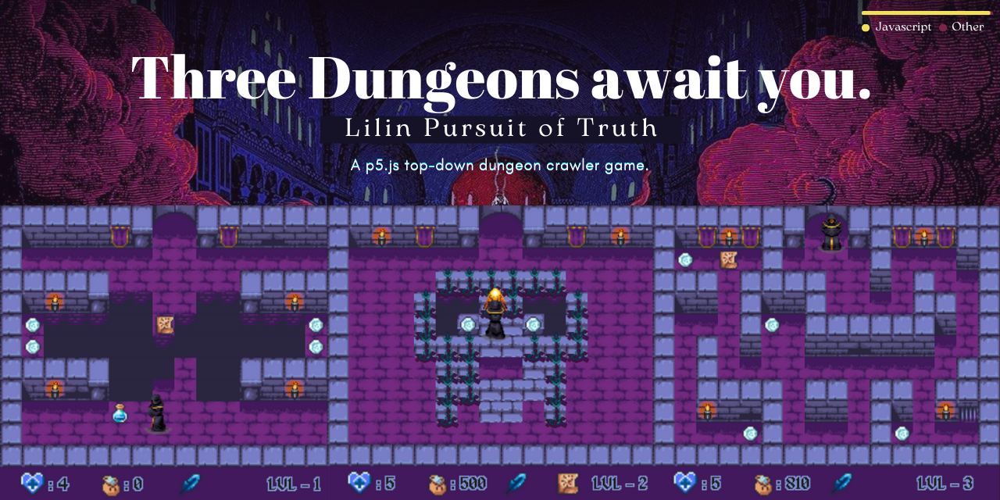

# Lilin Pursuit of Truth

This short game was implemented in the context of our Multimedia Technology semester assignment. The game was developed in javascript utilising the p5.js, p5.play.js and p5.sound.js libraries.

# Table of contents
- [Technologies used](#technologies-used)
- [Game Description](#game-description)
- [Main Concepts of the Game](#main-concepts-of-the-game)
  * [Player](#player)
  * [Stages](#stages)
  * [Graphics](#graphics)
  * [Sounds](#sounds)
- [Project Layout](#project-layout)
  * [Assets](#assets)
  * [Libraties](#libraries)
  * [Src](#src)
  * [Other files](#other-files)
- [Member Contribution](#member-contribution)
- [Issues and Overcoming them](#issues-and-overcoming-them)
  * [Non-Looping Animation](#non-looping-animation)
  * [Jumping to Levitating](#jumping-to-levitating)
  * [Player Collision](#player-collision)
- [How to launch the game](#how-to-launch-the-game)
  * [Prerequisites](#prerequisites)
  * [Running with VS Code](#running-with-vs-code)
  * [Running with Node http-server](#running-with-node-http-server)
  * [Other ways to run](#other-ways-to-run)
- [How to play](#how-to-play)
- [Credits](#credits)
  * [Visuals](#visuals)
  * [Audio](#audio)
  * [Story](#story)


# Technologies used

## [Javascript](https://www.javascript.com)
**Javascript** is one of the world’s most popular programming languages. Most modern web applications are entirely made in Javascript. This programming language is relatively easy to learn and use even for entry level devs. 

## [p5.js](https://p5js.org)
**p5.js** is a free, open source JavaScript library for creative coding, with a focus on making coding accessible and inclusive to everyone. The library’s main concept is the sketch script which can be loaded in an html page. Subsequently, you can think of your whole browser page as your sketch, and include HTML5 objects additional to those provided by the library.

Thanks to the library being open source, a lot of specialised p5.js libraries have been created including p5.play.js and p5.sound.js.

### [p5.play.js](https://molleindustria.github.io/p5.play/)
**p5.play.js** is a p5.js library for the creation of games and playthings. It provides a Sprite class to manage visual objects in 2D space and features such as animation support, basic collision detection and resolution, sprite grouping, helpers for mouse and keyboard interactions, and a virtual camera. It is designed to be understood and possibly modified by intermediate programmers, which in turn helped us further develop and customise our project.

### [p5.sound.js](https://p5js.org/reference/#/libraries/p5.sound)
**p5.sound.js** extends p5 with Web Audio functionality including audio input, playback, analysis and synthesis. 

### [p5.gif](https://github.com/antiboredom/p5.gif.js/tree/master)
**p5.gif** is a library that lets you play animated gifs in p5.js sketches.

# Game Description

**Lilin Pursuit of Truth** is a top-down dungeon crawler heavily inspired by NES adventure games. The game consists of 3 levels and 4 possible endings (not including the player running out of lives).

The playable character is a cultist with the ability to read. They are on their quest into our dungeon to retrieve 3 scrolls and find out The Truth. Inside our dungeon the player will have to face abyssal pits and poisonous plants. 

Thankfully, their years of studying the arcane arts have equipped them with a fire attack spell able to destroy any enemy standing on their path. 

Further adding to their arsenal are the pickable hearts scattered across the ruins as well as a potion which grants them the ability to levitate for 8 seconds.

By collecting treasures and obliterating their enemies they can increase your score, but everything comes at a price.

Traversing the dungeon, is taking a toll on the cultist’s sanity. The longer you take to complete the game, the closer they tread on losing their mind. 

The counter on top of the screen lets you know how much time you have left, but be careful - killing enemies and indulging their opulence decreases the counter substantially.

# Main Concepts of the Game

## Player

The player has some information about his status, displayed on the status bar beneath the level. 
* **Lives** - How many lives the player has left. Starting value is 3.
* **Score** - How many points the player has collected.
* **Levitation** - If the player can levitate a counter is displayed next to the feather icon of the status bar.
* **Scroll** - If that level’s scroll has been picked up, its icon is displayed in the status bar.

The player’s sprite can collide with the sprites of some elements of the map. The collision of those sprites has a different effect for each of those elements.
	
*  **Wall** - The player gets pushed back an equal amount to his speed, thus they get stopped.
* **Pits** - The player loses a life and respawns at the starting position of the level. If they run out of lives, they die. (Ignored if the player has a floating potion) 
* **Coins** - The coin gets “picked up” (disappears) and the value 10 is added to the player’s score. The sanity counter is decreased by 1.
* **Hearts** - The one-up gets “picked up” (disappears) and one more life is granted to the player.
* **Enemies** -  
    * If the player collides with a plant without attacking it, they lose a life and respawn at the starting position of the level. 
    * If they run out of lives, they die.
    * If the player collides with a plant while attacking, the plant gets “killed” (disappears) and the value 100 is added to the player’s score. The sanity counter is decreased by 3.
* **Exit** - 
    * If the player collides with an exit tile without having collected that level’s scroll, their mind is not ready for what they face on the other side. They die instantaneously and have to restart the game.
    * If the player collides with an exit tile after having collected that level’s scroll, they move onto the next level.

## Stages

### Start Screens    
At the beginning of the game, the player is provided with a title screen, followed by a screen displaying instructions on how to play.

### Levels
The level consists of a 16x12 tile map. Each level has a scroll, needed to move forward onto the next one. 

### Scrolls
After level completion, the player gets to read that level’s scroll. 

### Timer
Timer represents our character's time left before he loses his sanity. Each second our character spends in the dungeon takes away 1 second from his sanity timer. 

### Endings
* If the player tries to move to the next level without having acquired that level’s scroll, an end screen is displayed. The player dies instantaneously.
* If the player escapes the ruins with his sanity intact he gets to choose if he’ll bear the truth and go crazy, or if he’ll take his own life because he can’t live with it. Each choice results in a different screen.
* If the sanity counter is below zero, a different end screen is displayed and no choice is ever provided. In his attempt to escape his suffering. Having realised they are but a pawn to a game, the character begs for the game to end.

## Graphics

### The Player
The player character has fully animated sprites for moving up, down and left-right (same one mirrored), as well as attacking up, down and left-right. Additionally, they have a respawn animation for when they are spawned in the starting point of a level after losing a life. They also have a simple death animation which plays once when they lose all lives.

### The Eye
Above the ever decreasing sanity counter, you will start to notice an eye taking shape as it opens wider and wider still. The eye -at first not at all visible- consists of 8 frames that get gradually drawn on top of one another.

The first one appears once the counter has decreased by 20. The second after 20 points more, and so on. During the last 20 points above zero, the eye is now fully open. It remains open even as the counter takes values below zero.

### Enemies
Instead of a sprite with multi-layer animation, the plant enemies’ graphics are  gifs which loop, moving their vines back and forth.

### Torches
Same as the plant, the torches placed around the map are gifs. They have a  bright orange wall tile placed beneath them to give off a “glowing” effect.

### Tile Map
The map consists of a 16x12 array of elements taken from the picture [here](./assets/images/tiles/dungeon-tileset-full.png).

The original tileset image is sized 128x64 pixels, each tile taking up a 16x16 pixel square. As you will see in the game, not all tiles made it into the levels. 

## Sounds
The game’s audio consists of 5 tracks, and 7 SFX. All looping tracks have been cropped to play over and over (somewhat) seamlessly.

### Tracks 
All tracks have been taken from the Castlevania Trilogy’s Original Soundtracks. More specifically from Castlevania, Castlevania II - Simon’s Quest, Castlevania III - Dracula’s Curse (NES). 

* **Character Encounter** - 12 second looping track, used in start, scroll screens.
* **Message Of Darkness** - 16 second looping track, used in levels.
* **Bloody Tears** - 30 second looping track, used in escape while sane ending.
* **Nightmare** - 35 second looping track, used in ending lost sanity ending.
* **Poison Mind** - 7 second looping track, used in instant death ending. 
* **Sweet Death (Game Over)** - 6 second track used when player loses all lives.

### SFX
Most of the SFX are also taken from the Castlevania Trilogy. Others are from Yoshi's Cookie (NES).

* **coin** - used when player picks up a coin.
* **heart** - used when player picks up a one-up.
* **potion** - used when player picks up a potion.
* **scroll** - used when player picks up a scroll.
* **fireball** - used when player attacks.
* **scream** - used when player loses a life.

# Project Layout
The walkthrough of the files will be following the structure of the project's folders as they appear in any IDE- explorer.

* ## Assets
  * ### Fonts
    This folder contains the `.ttf` file of the font we used in the game.
  * ### Images
    * #### eye
      This folder contains the frames that make up the eye animation above the timer.
    * #### player1
      This folder is devided further into 3 folders (D, RL, U) each one of them contains all the needed frames to make up the player's animations at different directions (Down, RightLeft, Up).
    * #### tiles
      The tiles folder contains the `.png` image of the inanimate tiles as well as 2 `.gif` for the animated tiles (torch and enemy - plant). Additionally, to list the tiles in the `dungeon-tileset-full.png`, by marking them with a name and their "position" (row, column) of each individual tile, `tiles.json` was created and used in the code.
    * #### Other images
      Other `.png` and `.gif` files are stores in the images folder that are either used for the starting/ ending/ instructions screens as well as the shadow of the player and the icon of the game for the web tab.
  * ### Sound
      * #### SFX
        This folder contains all the `.wav` or `.mp3` files that were used as sound effects in the game.
      * #### tracks
        This folder contains all the `.wav` files that were used as music in the game.
  * ### `levels.json` file
    This file contains a `JSON` object that has the following properties:
      * `prologue_x`, `x = 1..4`. Each of these properties is a `string` that has the script of the prologue screens, the number following the `prologue` prefix is the number of the screen the script belongs to.
      * `map_x`, `x = 1..3`. Each of these properties is a 2D Array of `int` that store the layout of the map of the levels, the number following the `map` prefix is the number of the level the map belongs to. Each number corresponds to an item from the `tiles.json` file, whereas 33 that is not found in that list is matched to the `torch` item and -1 indicates that there should be no tile drawn in that placement.
      * `items_x`, `x = 1..3`. Each of these properties is a 2D Array of `int` that store the layout of the items of the map of the levels, the number following the `items` prefix is the number of the level the items belong to. Each number corresponds to an item from the `tiles.json` file, whereas 33 that is not found in that list is matched to the `torch` item and -1 indicates that there should be no tile drawn in that placement.
      * `scroll_x_move`, `x = 1..3`. Each of these properties is a `boolean` that indicates if the scroll item should move in a live motion on the level or not, the number following the `scroll` prefix is the number of the level the scroll belongs to.
      * `scroll_x`, `x = 1..3`. Each of these properties is a `string` that stores the scroll contents of each level, the number following the `scroll` prefix is the number of the level the scroll content belongs to and is shown after the relative level completion.
      * `ending_x`, `x = n, m, p, c`. Each of these properties is a `string` that has the script of the ending screens, the character following the `ending` prefix is the type of the ending the script belongs to. Specifically, n is the ending that the player finds about the truth but choses to die, m is the ending that he choses to endure, whereas p is the premature ending and c is the glitch ending.
* ## Libraries
  This folder stores all the `p5.js ` libraries that were used for developing and that are needed for running the game.
* ## Src
  This folder contains some extra `.js` files we had to implement for the game. They are stored in a seperate folder in order to keep the general `p5.js` project structure. The files are the following: 
    * ### `map.js`
      This file contains the `Map` class that is used to represent map objects, as they were described in the concepts.
    * ### `player.js`
      This file contains the `Player` class that is used to represent player instances, specifically one used in the whole game, as it was described in the concepts.
    * ### `status.js`
      This file contains the `Status` class that is used to represent the status of a player, specifically one used in the whole game, as it was described in the concepts.
    * ### `tile.js`
      This file contains the `Tile` class that is used to represent the tiles that make up a map, both layout and item tiles, as they were described in the concepts.
* ## Other files
  * ### `index.html`
    This is the needed `.html` file that loads the `.json` scrips and opens as a tab in the browser. Also typical in a `p5.js` project.
  * ### `jsonconfig.json`
    A configuration file to include the scripts needed.
  * ### `sketch.js`
    This file is the main file of a `p5.js` project. This one contains the functions needed for loading the assets and then drawing - showing them on the user's browser and support the logic implemented for them.
  * ### `style.css`
    We need to reassure that the `index.html` page has no margin or padding in the browser layout as well as that the `canvas` property of `p5.js` is styled in a block display to properly work. Also typical in a `p5.js` project.

### **Note:** All of the `.js` scripts are sufficiently commented to describe the functionality of the code.
     

# Member Contribution
This project was conceptualised by all of us as we went on with the implementation. A lot of things changed from the original draft, including- but not limited to- the final product being so story heavy, as well as the game being a top-down view dungeon crawler instead of a platformer.

More specifically we developed the following as a group, either by working simultaneously or by building up on what the other had already worked on:

* Theme Choice
* Overarching Story
* Seeking for & Editing appropriate Tiles, Sprites and gifs
* Conceptualisation of 4 possible endings
* Settling on Items
* Madness Mechanic
* **Play Testing**

Still, all separately developed segments were implemented after being outlined by the team as a group and with regular check-ins and progress updates.

Indicatively and in alphabetical order, the members of our team have contributed to this project as such:

* **@solaunar**
  * Player Controls & Animations
  * Scrolls' Implementation
  * End Screens Implementation
  * Madness & Levitation Counters
  * Level 1 Idea (Chasm and moving Scroll)

* **@VasilhsToskas**
  * Item & Enemy Collisions
  * Item & Enemy Implementation
  * Status Bar
  * Level 2 Idea (Skull made from Enemies)
  * Author of original Script

* **@DebsTheLemon**
  * Level Map Tuning & Implementation
  * Wall Collisions
  * Sound Implementation
  * Start Screens Implementation
  * Level 3 Idea (Labyrinth)

### *Special credit and a huge thank you must be given to Ms **@solaunar** for a complete clean-up and refactoring of our code.*

### Many bugs were also spotted by friends playing this game after following our [instructions](#how-to-launch-the-game). Third-party play testing helped us immensely in finding errors we would have never thought existed but were obvious to someone not associated with the game's development.
# Issues and Overcoming them
This section is devoted to challenges we came across during the development of this project and how we ended up facing them ...or in some cases embracing them.

## Non-Looping Animation
The character animations for walking and attacking are all looping, as long as that certain action's button is being pressed. However, when it came to adding a death animation for when all lives were lost, we run across the issue of making that death animation only play *once*.

Οur fix was implementing a counter indicating how long the animation was meant to play out for. As long as the counter hadn't run out, the animation kept playing; all we had to do is make sure said counter was short enough for the animation to play out just once.

## Jumping to Levitating
In our attempt to implement a jumping action we faced the issue of being unable to stop said action. Instead of jumping once, reaching a maximum height and then falling down, the player could keep jumping by spamming the jump action button. It looked like the character was floating.

Well floating *is* undoubtedly more original than jumping, and this *is* a game with eldritch themes and dark magic, so floating seemed more fitting. We ended up implementing the floating potion which grants the ability to the player to float for 10 seconds, a mechanic that much better suited our level plans and obstacles.

## Player Collision
Our perspective is top-down (aka *angled top-down*), unlike the true top-down view, you are able to see the side of each wall taking up the space beneath it. Those side walls are where we place our torches, banners etc. 

When it came to making the player collide with those walls, is when we realised that the player's collision box simply couldn't be the player's sprite. The top most part of the sprite, the head, would collide with the wall in a non-sensical way when the player *should* be able to walk closer to the wall still.

After multiple attempts at containing the collision box to the sprite's lower half, we found the solution we were looking for. The collision box is not based on the player's sprite, but rather the player's *shadow* sprite. This way traversing the dungeon feels natural, you are only "crushing" with what you can't walk on.

# How to launch the game
## Prerequisites
* Any web browser, we strongly recommend to use [Microsoft Edge](https://www.microsoft.com/el-gr/edge), due to the fact that the contents load much faster.
* [Visual Studio Code](https://code.visualstudio.com) ***or*** [node.js](https://nodejs.org/en/) installed.

## Running with VS Code
* Install [Live Server extension](https://marketplace.visualstudio.com/items?itemName=ritwickdey.LiveServer).
* Open the folder of the project with the IDE.
* With your project's index.html or sketch.js file open, start the Live Server using the "Go Live" button in the status bar, or by using `ALT-L` `ALT-O`.
* The game should now launch in your default browser at location: `127.0.0.1:5500`. For the game to run faster, please visit the location from Microsoft Edge as mentioned. 

## Running with Node http-server
* Open a terminal or command prompt (on Windows you might need to open the command prompt as admin).
* In the terminal type:

    ```
    npm install -g http-server
    ```
    
    To install the required node package.
* From then on just cd to the folder of the project and type:

    ```
    http-server
    ```
* The server should then start running and will print the following information:
    ```
    Starting up http-server, serving ./

    http-server version: 14.0.0

    http-server settings:
    CORS: disabled
    Cache: 3600 seconds
    Connection Timeout: 120 seconds
    Directory Listings: visible
    AutoIndex: visible
    Serve GZIP Files: false
    Serve Brotli Files: false
    Default File Extension: none

    Available on:
    http://127.0.0.1:8080
    Hit CTRL-C to stop the server
    ```
* Visit one of the **Available on** links with your browser to launch the game.

## Other ways to run
Other ways to run a p5.js project/ launch the game, can be found [here](https://github.com/processing/p5.js/wiki/Local-server).

# How to play
Once the game launches please wait a couple of minutes (1 to 3 should do the trick) until the **PRESS SPACE TO START** message on your screen starts flashing faster.

The controls should appear after the starting screen explaining the player movements.


# Credits

## Visuals
The following sprites were slighty edited to fit our needs for the game.
* [Character Sprites](https://sventhole.itch.io/top-down-cultist): sventhole.itchio.io
* [Enemy Sprites](https://jeevo.itch.io/plants)
* [Item Sprites](https://clockworkraven.itch.io/5600-ultimate-pixel-art-fantasy-rpg-icon-pack): clockworkraven.itch.io
* [Map Tiles](https://ansimuz.itch.io/patreons-top-down-collection): ansimuz.itch.io
* [Start Screen Gif](https://cannonbreedpixels.tumblr.com/post/635225742562738176/have-a-rest): cannonbreedpixles.tumblr
* [End Screen Gif](https://pixeljoint.com/forum/forum_posts.asp?TID=26333)
* [Font](https://www.dafont.com/alagard.font): Alagard by Hewett Tsoi

## Audio
* Castlevania (NES)
* Castlevania II - Simon’s Quest (NES)
* Castlevania III - Dracula’s Curse (NES)
* Yoshi's Cookie (NES)

## Story
Original script from our team, inspired by eldritch themes and literature.
The script can be found [here](./story.pdf).
